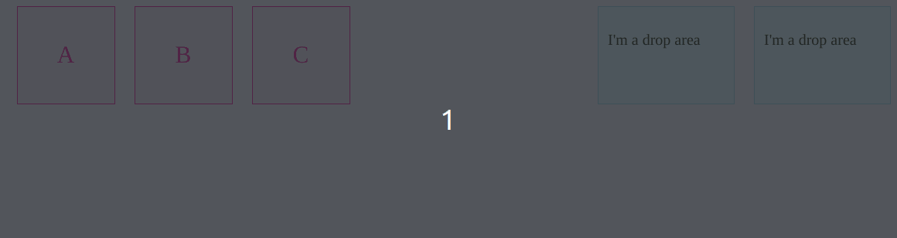

There's a few drag and drop libraries, but depending on what you're trying to build and your stack, using the HTML drag and drop API may be the way to go. This is a simple guide and demo to empower you to build your first drag and drop feature without libraries.

## What are we building

explain and link de demo here
https://codepen.io/flavianunes/pen/BaqBKgy?editors=0011

## Drag Events

A drag-and-drop action starts when the user selects and drag a draggable element and ends when the user releases the element to a droppable area. During that interaction, a few events are triggered:

- `dragstart`: the user starts dragging a draggable element
- `drag`: a draggable element is being dragged
- `dragend`: a drag action ends (releasing the mouse button for example)
- `dragenter`: the element being dragged enters a valid droppable element
- `dragover`: the element being dragged is in a valid droppable element (triggered every few hundred milliseconds)
- `dragleave`: the element being dragged leaves the droppable element
- `drop`: the element being dragged is dropped in a valid droppable element

### Draggable and Droppable Elements

To make an element draggable, we need to specify using the `draggable` global attribute and the `ondragstart` event. The `draggable` attribute indicates if the element can be dragged (`true`) or not (`false`).

```html
<p draggable="true" ondragstart="dragstartHandler(event)">
  this is a draggable element
</p>

<script>
  function dragstartHandler(e) {
    e.preventDefault()
    console.log("dragstart", e.target)
  }
</script>
```

Now, to make an element a droppable area, we need to specify `ondrop` and `ondragover` events. The `ondragover` event must be cancelled with `preventDefault` to allow drops in the element. The `ondrop` event specify what happens once an element is dropped.

```html
<div
  class="stack"
  id="first-stack"
  ondrop="dropHandler(event)"
  ondragover="dragoverHandler(event)"
>
  <p>I'm a drop area</p>
</div>

<script>
  function dropHandler(e) {
    console.log("dropHandler", e)
  }

  function dragoverHandler(e) {
    e.preventDefault()
    console.log("dragoverHandler")
  }
</script>
```

### Setting data

We can set data about the drag operation at the drag event. For example, we can set what "effect" we want during the drag event like this:

```javascript
e.dataTransfer.dropEffect = "move"
```

This will display the "move" cursor, indicating that the dragged element will be moved from to the drop area.

We can use `dataTransfer` to actually do the move, by setting the draggable element id with `setData` during the `dragstart` and getting that id with `getData` during the `drop`.

```javascript
function dragstartHandler(e) {
  e.dataTransfer.setData("text/plain", e.target.id)
}

function dropHandler(e) {
  e.dataTransfer.dropEffect = "move"
  const data = e.dataTransfer.getData("text/plain")
  e.target.appendChild(document.getElementById(data))
}
```


